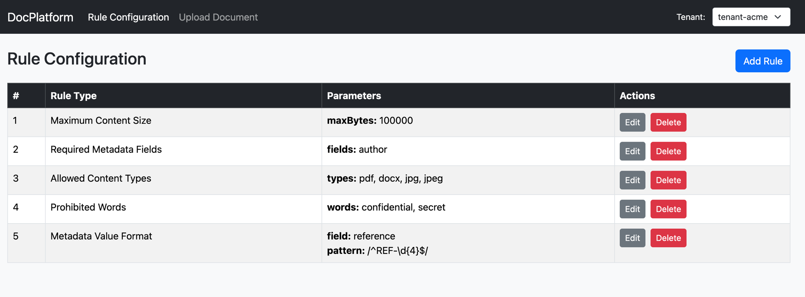
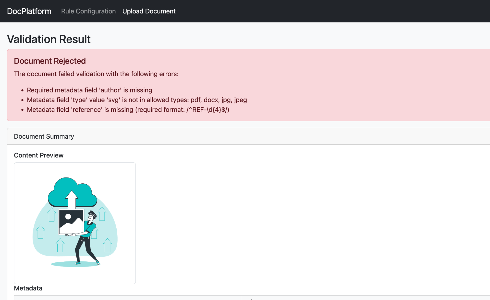
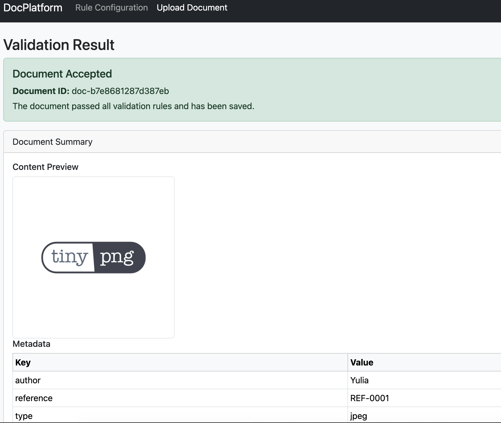

# DocPlatform

A multi-tenant document validation platform in pure PHP 8.1+. Each tenant manages its own set of validation rules; uploaded documents are checked against those rules and the results are stored per tenant.

## Setup

```bash
composer install
php seed.php               # creates runtime/tenants.sqlite3 and seeds tenant DBs
php -S localhost:8080 -t public
```

Open `http://localhost:8080` — you will be redirected to the rules list for the first tenant.

## Demo

**Rule Configuration** — manage per-tenant validation rules:



**Document Rejected** — all validation errors shown in one response:



**Document Accepted** — document passes all rules and is saved:



## Design Reasoning

Validation rules are modelled as interchangeable strategies, each implementing `ValidationRuleInterface::validate(Document): string[]`. The `ValidatorService` runs every applicable rule, merges all errors, and returns a single `ValidationResult` object — so a submitter sees every problem in one response rather than discovering violations one at a time.

Adding a new rule type requires creating two small classes: an implementation (`ValidationRuleInterface`) and a configuration (`AbstractRuleConfiguration`). No existing class changes. The `RuleConfigurationManager` acts as a self-describing registry: it knows how to instantiate each rule from its persisted parameters and how to describe its parameter schema — the same source of truth drives both the dynamic UI form fields and runtime rule construction.

Tenant isolation is enforced at the storage layer. A central `tenants.sqlite3` registry maps tenant IDs to their database paths; each tenant's rules and uploaded files live in a dedicated per-tenant SQLite file. One tenant's data is unreachable from another tenant's queries by construction, not by convention. The `AppServiceProvider` resolves the correct database connection at request time and wires all dependencies in one place.

The HTTP layer is intentionally thin and framework-free. A hand-rolled `Router` handles parameterised path matching for the JSON API (`/api/tenants/{tenantId}/rules`) while UI routes dispatch directly in `index.php`. Controllers are stateless and receive dependencies as constructor arguments, delegating all logic to the service layer behind typed interfaces (`RuleServiceInterface`, `ValidatorServiceInterface`). This keeps the service layer independently testable without bootstrapping HTTP machinery.

## Validation Rules

| Rule | Constructor params | What it checks |
|---|---|---|
| `MaxSizeRule` | `int $maxBytes` | `strlen($content) <= $maxBytes` |
| `ProhibitedWordsRule` | `array $words` | None of `$words` appear in `$textContent` (case-insensitive; each violation reported separately) |
| `RequiredMetadataRule` | `array $fields` | All `$fields` exist as keys in `$metadata` (every missing field reported) |
| `AllowedContentTypeRule` | `array $types` | `$metadata['type']` is in `$types` (missing key → descriptive error, no exception) |
| `MetadataValueFormatRule` | `string $field, string $pattern` | `$metadata[$field]` matches regex `$pattern` (missing field → descriptive error, no exception) |

## Quick Demo (no web server)

Short integration script that demonstrates:
- Creating several validation rules
- Creating a validator
- Determining which validation rules apply for a given tenant ID
- Validating a document using those rules
- Handling both success and validation errors

```bash
php integration.php
```

## Running Tests

```bash
./vendor/bin/phpunit
```